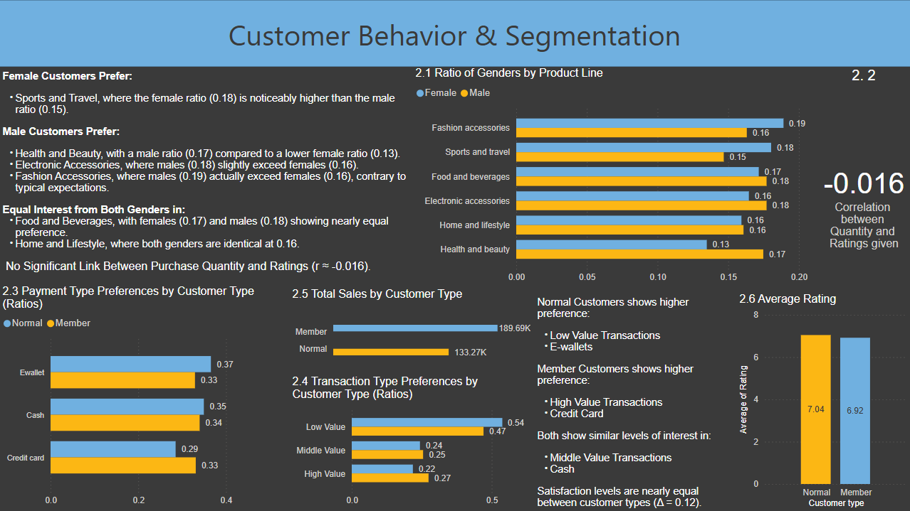
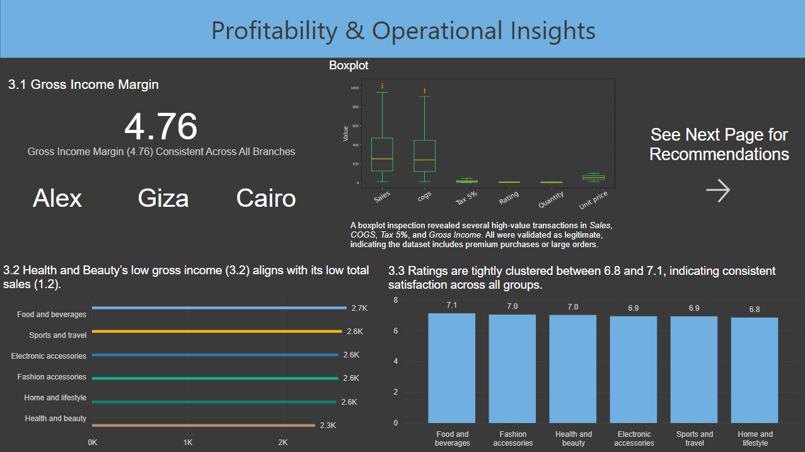
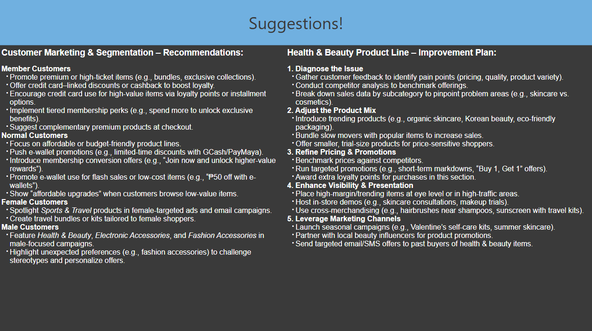

# Pandas-PowerQuery-PowerBI-Demo

This repository contains the code, analysis, and dashboard for the project **"Pandas-PowerQuery-PowerBI-Demo"** — an end-to-end data analytics case study.

## 📌 Overview

This project demonstrates **data preparation, analysis, visualization, and storytelling** using **Pandas**, **Power Query**, and **Power BI**.
It covers the full workflow from raw data to actionable business insights.

**Core skills showcased:**
- Data cleaning and preprocessing
- Exploratory Data Analysis (EDA)
- Business-oriented data storytelling
- Interactive dashboard creation

## 🧠 Objectives

The analysis answers key business questions in four main areas:

1. **Sales Performance Analysis**  
   1.1 Which branch generates the highest revenue?  
   1.2 What is the sum of sales per product line?  
   1.3 Which day of the week or time of day has the highest sales?  
   1.4 What is the average transaction value?  
   1.5 Which payment method is most popular?  

2. **Customer Behavior & Segmentation**  
   2.1 Do men and women prefer different product lines?  
   2.2 Is there a correlation between the quantity purchased and the customer rating?  
   2.3 – 2.6 Are there noticeable differences in purchasing behavior between Members and Normal customers?  
   &nbsp;&nbsp;&nbsp;&nbsp;2.3 Payment Type  
   &nbsp;&nbsp;&nbsp;&nbsp;2.4 Transaction Type  
   &nbsp;&nbsp;&nbsp;&nbsp;2.5 Sales  
   &nbsp;&nbsp;&nbsp;&nbsp;2.6 Ratings  

3. **Profitability & Operational Insights**  
   3.1 Which branch or city has the highest gross income margin?  
   3.2 What is the gross income per product line?  
   3.3 Are there underperforming product lines in ratings?  

4. **Marketing & Business Strategy**  
   - Which product line should the supermarket promote more based on profitability and popularity?  
   - Which branch should the company invest more in based on sales growth potential?  
   - Can we segment customers based on their buying behavior or product preferences?  
   - Are promotions or discounts during certain times/days likely to improve revenue?  
   - Can we identify cross-sell or upsell opportunities based on purchase patterns?  

## 📊 Power BI Dashboard

### 🔍 Preview

  
  
  
  

📥 **[Download Dashboard](Supermarket.pbix)** – open in Power BI Desktop for full interactivity.

## 🧾 Python & Excel Files

- 🐍 **[Supermarket.ipynb](Supermarket.ipynb)** – Python code for data cleaning, transformation, and analysis.  
- 📊 **[supermarket_ratios.xlsx](supermarket_ratios.xlsx)** – Excel file storing calculated ratios for further reporting.

## 📊 Data Source

Dataset used: **[Supermarket Analysis](<SuperMarket Analysis.csv>)**  
📄 [View on Kaggle](https://www.kaggle.com/datasets/faresashraf1001/supermarket-sales)

## ✉️ Contact

For questions, feedback, or collaboration:  

**Dylan Cortez**  
📧 cortezdylan2135@gmail.com
